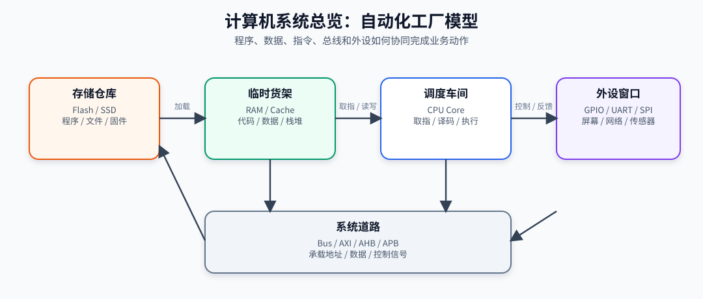
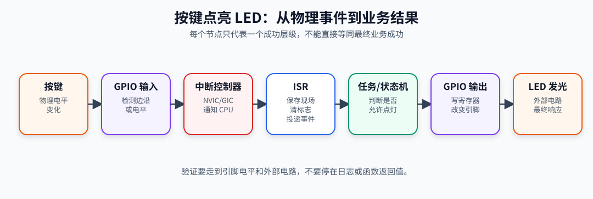
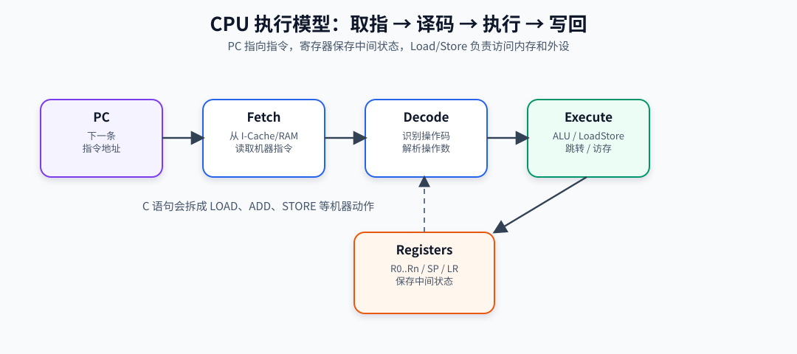
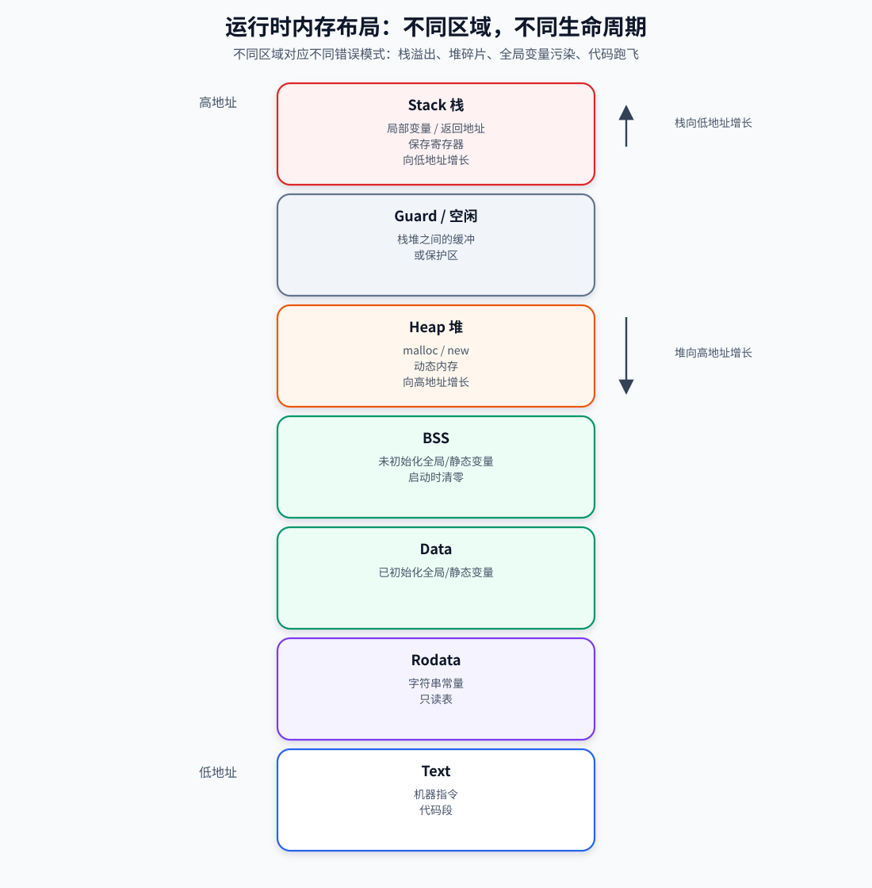
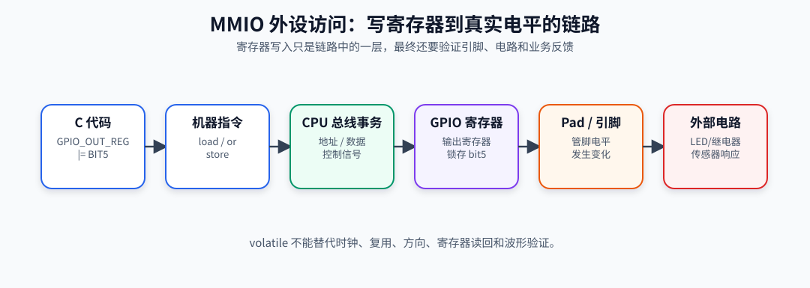
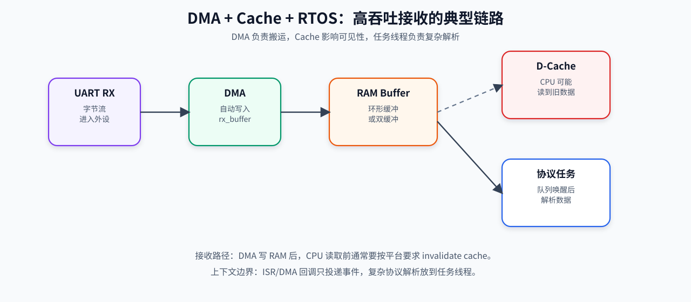
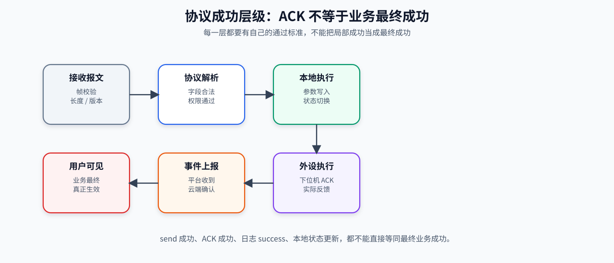
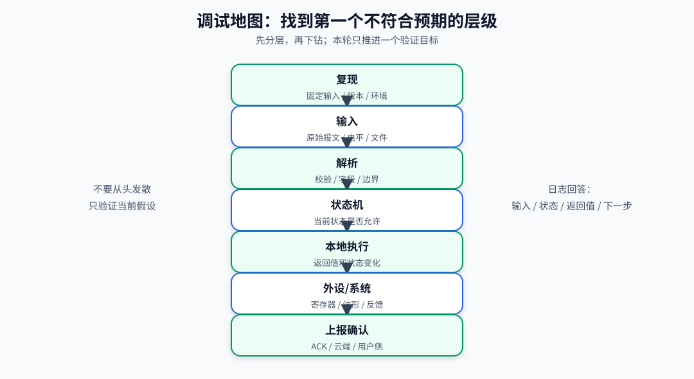

# 图解计算机原理教程：从 0/1 到系统运行

> 目标：用“生动图例 + 工程链路 + 最小实验”理解计算机如何从上电、执行指令、访问内存、驱动外设，到完成一个真实业务动作。
> 风格：先建立直觉，再落到专业模型；先看全链路，再拆局部细节；每章都给调试抓手和验证闭环。
> 适合对象：嵌入式工程师、系统软件工程师、应用开发者、计算机组成原理学习者。

---

## 0. 先给总图：计算机是一座“自动化工厂”



**结论：计算机不是魔法，它是一座高速自动化工厂：CPU 是调度车间，内存是临时货架，存储是仓库，总线是道路，外设是和现实世界交互的窗口。**

```text
                         ┌──────────────────────────┐
                         │        人 / 云 / 设备       │
                         │ 键盘、屏幕、网络、传感器、执行器 │
                         └────────────┬─────────────┘
                                      │ 输入/输出事件
                                      ▼
┌─────────────────────────────────────────────────────────────────┐
│                         计算机系统                               │
│                                                                 │
│  ┌──────────────┐       ┌──────────────┐       ┌──────────────┐  │
│  │   存储仓库    │       │   临时货架    │       │   调度车间    │  │
│  │ Flash/SSD    │ ───►  │ RAM/Cache    │ ◄──►  │ CPU/Core     │  │
│  │ 程序/文件/固件 │ 加载  │ 代码/数据/栈堆 │ 取指  │ 取指/译码/执行 │  │
│  └──────┬───────┘       └──────┬───────┘       └──────┬───────┘  │
│         │                      │                      │          │
│         └──────────────┬───────┴──────────────┬───────┘          │
│                        ▼                      ▼                  │
│                 ┌──────────────┐       ┌──────────────┐          │
│                 │   系统道路    │       │  外设窗口     │          │
│                 │ Bus/AXI/AHB   │ ◄──►  │ GPIO/UART/...│          │
│                 └──────────────┘       └──────────────┘          │
└─────────────────────────────────────────────────────────────────┘
```

### 0.1 一条业务动作的真实链路



以“按键点亮 LED”为例，真实链路不是一句 `led_on()`，而是：

```text
手按下按键
  │  物理电平变化
  ▼
GPIO 输入引脚
  │  外设检测边沿/电平
  ▼
中断控制器 NVIC/GIC
  │  通知 CPU
  ▼
CPU 保存现场并进入 ISR
  │  清标志、读状态、投递事件
  ▼
任务线程/主循环处理事件
  │  状态机判断是否允许点灯
  ▼
GPIO 驱动写输出寄存器
  │  总线事务到达 GPIO 控制器
  ▼
LED 引脚电平变化
  │  外部电路导通
  ▼
LED 发光
```

### 0.2 学习本教程要抓住 6 条主线

| 主线 | 你要能回答的问题 | 工程价值 |
|---|---|---|
| 数据如何表示 | 0/1 如何变成整数、字符、指针、协议字段 | 避免类型、字节序、编码误判 |
| 指令如何执行 | CPU 如何取指、译码、执行、跳转 | 理解崩溃、跑飞、异常现场 |
| 内存如何组织 | 栈、堆、全局变量、代码段在哪里 | 定位越界、栈溢出、内存泄漏 |
| 外设如何控制 | 写寄存器如何变成电平、波形、报文 | 调试 GPIO、UART、SPI、I2C、CAN |
| 并发如何发生 | 中断、DMA、任务、回调如何交织 | 定位竞态、丢包、死锁、时序问题 |
| 成功如何验证 | 哪一层成功，哪一层还没成功 | 避免把 ACK/日志/返回值当最终业务成功 |

---

## 1. 二进制：硬件世界的“黑白积木”

**结论：二进制的本质是稳定性。硬件最容易区分“低电平/高电平”两种状态，所以所有信息最终都被编码成 0 和 1。**

### 1.1 从电平到含义

```text
现实物理量
电压：0V ─────────────── 3.3V
      │                  │
      ▼                  ▼
逻辑：0                  1
      │                  │
      └────── bit ───────┘

8 个 bit 组成 1 个 byte：
┌───┬───┬───┬───┬───┬───┬───┬───┐
│ 0 │ 1 │ 0 │ 0 │ 0 │ 0 │ 0 │ 1 │  = 0x41
└───┴───┴───┴───┴───┴───┴───┴───┘
                  │
                  ├─ 按 unsigned char 解释：65
                  ├─ 按 ASCII 解释：'A'
                  └─ 按协议字段解释：某个命令字/状态位
```

### 1.2 同一组 bit，不同解释规则

| 原始字节 | 解释方式 | 结果 |
|---|---|---|
| `0x41` | 无符号整数 | `65` |
| `0x41` | ASCII 字符 | `'A'` |
| `0x41` | bit mask | bit0 和 bit6 为 1 |
| `0x41` | 协议命令 | 取决于协议定义 |

**工程原则：数据本身没有语义，语义来自类型、协议、寄存器手册或编码规则。**

### 1.3 字节序：多字节数据的摆放方向

```text
数值：0x12345678

大端 Big Endian：高位字节放低地址
地址：  0x1000  0x1001  0x1002  0x1003
内容：   0x12    0x34    0x56    0x78

小端 Little Endian：低位字节放低地址
地址：  0x1000  0x1001  0x1002  0x1003
内容：   0x78    0x56    0x34    0x12
```

### 1.4 最小实验

```c
#include <stdio.h>
#include <stdint.h>

int main(void) {
    uint32_t x = 0x12345678;
    uint8_t *p = (uint8_t *)&x;

    printf("value = 0x%08x\n", x);
    printf("memory = %02x %02x %02x %02x\n", p[0], p[1], p[2], p[3]);
    return 0;
}
```

通过标准：你能根据输出判断当前机器是大端还是小端。

---

## 2. CPU：执行指令的“流水线车间”

**结论：CPU 不直接执行 C 代码，它执行机器指令；程序运行的核心循环是“取指 → 译码 → 执行 → 写回 → 更新 PC”。**

### 2.1 CPU 内部图



```text
                    ┌─────────────────────────┐
                    │          CPU Core        │
                    │                         │
指令地址 ─────────► │ PC 程序计数器            │
                    │   │                     │
                    │   ▼                     │
                    │ 指令获取 Fetch           │ ◄── I-Cache/Flash/RAM
                    │   │                     │
                    │   ▼                     │
                    │ 指令译码 Decode          │
                    │   │                     │
                    │   ├────────────┐        │
                    │   ▼            ▼        │
                    │ ALU 运算单元   Load/Store│ ◄── D-Cache/RAM/外设
                    │   │            │        │
                    │   ▼            ▼        │
                    │ 通用寄存器 R0..Rn        │
                    │   │                     │
                    │   ▼                     │
                    │ 状态寄存器 Flags/PSR     │
                    └─────────────────────────┘
```

### 2.2 关键寄存器不是抽象名词

| 名称 | 保存什么 | 调试时怎么用 |
|---|---|---|
| `PC` | 下一条或当前执行指令地址 | 判断是否跑飞到非法区域 |
| `SP` | 当前栈顶地址 | 判断栈是否越界或栈损坏 |
| `LR` | 函数返回地址/异常返回信息 | 追踪异常前从哪里来 |
| 通用寄存器 | 临时操作数、返回值、参数 | 分析崩溃瞬间的输入和中间值 |
| 状态寄存器 | 中断使能、条件标志、异常状态 | 判断是否处于异常/关中断状态 |

### 2.3 一句 C 代码如何变成 CPU 动作

```c
c = a + b;
```

可能变成类似下面的抽象指令：

```text
LOAD  R1, [addr_a]     ; 从内存取 a 到 R1
LOAD  R2, [addr_b]     ; 从内存取 b 到 R2
ADD   R3, R1, R2       ; ALU 执行加法
STORE R3, [addr_c]     ; 把结果写回 c
```

图解：

```text
RAM[addr_a] ──LOAD──► R1 ┐
                         ├──ADD──► R3 ──STORE──► RAM[addr_c]
RAM[addr_b] ──LOAD──► R2 ┘
```

### 2.4 异常现场的第一优先级

```text
崩溃/HardFault
  │
  ├─ PC 是否在合法代码区？
  ├─ SP 是否在合法栈范围？
  ├─ LR 能否回溯到调用点？
  ├─ 访问地址是否未对齐/越界/空指针？
  └─ 当前是否在 ISR 或临界区？
```

---

## 3. 内存：程序运行时的“货架和工作台”

**结论：内存不是一整块随便用的空间，它被划分成代码段、只读数据、全局数据、BSS、堆、栈等区域；不同区域的生命周期和错误模式完全不同。**

### 3.1 典型进程/固件内存布局



```text
高地址
┌──────────────────────────┐
│ 栈 Stack                  │  函数调用、局部变量、返回地址
│  ↓ 向低地址增长            │
├──────────────────────────┤
│ 空闲区 / mmap / guard      │
├──────────────────────────┤
│ 堆 Heap                   │  malloc/new 动态内存
│  ↑ 向高地址增长            │
├──────────────────────────┤
│ BSS                       │  未初始化全局/静态变量，启动时清零
├──────────────────────────┤
│ Data                      │  已初始化全局/静态变量
├──────────────────────────┤
│ Rodata                    │  字符串常量、只读表
├──────────────────────────┤
│ Text                      │  机器指令
└──────────────────────────┘
低地址
```

### 3.2 函数调用像“叠盘子”

```text
main() 调用 foo()，foo() 调用 bar()

调用后：
┌────────────────────┐
│ bar 栈帧            │  bar 的局部变量、保存寄存器、返回地址
├────────────────────┤
│ foo 栈帧            │  foo 的局部变量、保存寄存器、返回地址
├────────────────────┤
│ main 栈帧           │  main 的局部变量、保存寄存器、返回地址
└────────────────────┘

bar 返回后：
┌────────────────────┐
│ foo 栈帧            │
├────────────────────┤
│ main 栈帧           │
└────────────────────┘
```

### 3.3 常见内存问题图解

```text
数组越界写：

正常：
┌──────┬──────┬──────┬──────┬────────────┐
│ a[0] │ a[1] │ a[2] │ a[3] │ other_var  │
└──────┴──────┴──────┴──────┴────────────┘

错误写 a[4]：
┌──────┬──────┬──────┬──────┬────────────┐
│ a[0] │ a[1] │ a[2] │ a[3] │ 被破坏      │
└──────┴──────┴──────┴──────┴────────────┘
```

| 问题 | 典型现象 | 高价值验证点 |
|---|---|---|
| 栈溢出 | 随机崩溃、返回地址异常、任务莫名死掉 | 栈水位、`SP` 范围、栈保护哨兵 |
| 堆碎片 | 小内存还够但大块申请失败 | 最大连续空闲块、申请/释放序列 |
| 越界写 | 无关变量变化、状态机异常 | watchpoint、ASan、边界填充值 |
| Use After Free | 偶发崩溃、数据被复用污染 | free 后置空、内存毒化、生命周期审计 |

---

## 4. 编译、汇编、链接：源码进入机器世界的生产线

**结论：从 `.c` 到可执行文件，不是一跳完成，而是经过预处理、编译、汇编、链接；嵌入式还要关注链接脚本和镜像布局。**

### 4.1 构建流水线

```text
hello.c
  │
  │  预处理：展开 #include / #define / 条件编译
  ▼
hello.i
  │
  │  编译：C 语义分析、优化、生成汇编
  ▼
hello.s
  │
  │  汇编：汇编指令变机器码
  ▼
hello.o
  │
  │  链接：符号解析、地址分配、库合并、重定位
  ▼
ELF / EXE / BIN / HEX
```

### 4.2 链接器像“城市规划师”

```text
链接脚本决定地址地图：

Flash 0x08000000
┌──────────────────────────┐
│ 中断向量表 .isr_vector    │
├──────────────────────────┤
│ 代码 .text                │
├──────────────────────────┤
│ 只读数据 .rodata          │
├──────────────────────────┤
│ .data 初始值镜像          │
└──────────────────────────┘

RAM 0x20000000
┌──────────────────────────┐
│ .data 运行位置            │
├──────────────────────────┤
│ .bss                      │
├──────────────────────────┤
│ heap                      │
├──────────────────────────┤
│ stack                     │
└──────────────────────────┘
```

### 4.3 必须区分的成功层级

```text
编译成功
  ≠ 链接地址正确
  ≠ 镜像格式正确
  ≠ 烧录地址正确
  ≠ 启动代码正确
  ≠ main 正常运行
  ≠ 业务功能正确
```

---

## 5. 启动流程：`main()` 之前发生了什么

**结论：上电后 CPU 首先执行启动代码，不是直接进入 `main()`；启动代码要建立 C 运行环境。**

### 5.1 从复位到 main

```text
上电/复位
  │
  ▼
硬件读取复位向量
  │
  ├─ 初始 SP
  └─ Reset_Handler 地址
  │
  ▼
Reset_Handler
  │
  ├─ 配置时钟/PLL
  ├─ 设置向量表基址
  ├─ 拷贝 .data：Flash → RAM
  ├─ 清零 .bss
  ├─ 初始化堆/栈/运行库
  ├─ C++ 全局构造（如有）
  └─ 调用 main()
        │
        ▼
      应用初始化
```

### 5.2 `.data` 和 `.bss` 为什么重要

```text
Flash 中保存初始值：
┌──────────────┐
│ int g = 123; │  .data 初始镜像
└──────┬───────┘
       │ 启动时拷贝
       ▼
RAM 中运行变量：
┌──────────────┐
│ g = 123      │  程序运行时读写这里
└──────────────┘

.bss：
┌──────────────┐
│ static int x │  未初始化，启动时必须清零
└──────────────┘
```

### 5.3 启动失败排查图

```text
没有任何日志
  │
  ├─ 电源/复位/晶振是否正常？
  ├─ Boot 模式和启动地址是否正确？
  ├─ 向量表首项 SP 是否落在 RAM？
  ├─ Reset_Handler 地址是否落在 Flash 代码区？
  ├─ 时钟初始化是否卡死？
  └─ main 前是否访问了未初始化外设/内存？
```

---

## 6. 总线和寄存器：CPU 控制外设的“道路系统”

**结论：CPU 通过总线读写外设寄存器。写寄存器成功只是链路中的一层，不等于外设物理行为一定生效。**

### 6.1 内存映射 IO 图

```text
统一地址空间：

0x00000000 ┌──────────────┐
           │ Flash/ROM    │  取指令
0x20000000 ├──────────────┤
           │ RAM          │  读写变量、栈、堆
0x40000000 ├──────────────┤
           │ 外设寄存器    │  UART/GPIO/SPI/I2C...
0xE0000000 ├──────────────┤
           │ 系统控制寄存器 │  SysTick/NVIC/MPU...
           └──────────────┘
```

### 6.2 写 GPIO 的真实链路



```text
C 代码：GPIO_OUT_REG |= BIT5
  │
  ▼
编译成 load/or/store 指令
  │
  ▼
CPU 发起总线写事务
  │
  ▼
总线矩阵/桥接器转发到 GPIO 控制器
  │
  ▼
GPIO 输出数据寄存器锁存 bit5
  │
  ▼
Pad 控制器驱动芯片引脚
  │
  ▼
板级电路看到电平变化
```

### 6.3 一个 `volatile` 示例

```c
#define GPIO_OUT_REG (*(volatile unsigned int *)0x40020014u)

void gpio_set_bit5(void) {
    GPIO_OUT_REG |= (1u << 5);
}
```

`volatile` 只能保证编译器不要省略这次访问；它不能保证：

- 地址一定正确。
- bit5 一定对应目标引脚。
- GPIO 时钟已经打开。
- 管脚已经配置成输出。
- 外部电路一定响应。

### 6.4 外设调试顺序

```text
1. 时钟门控是否打开？
        │
2. 管脚复用是否正确？
        │
3. 方向/上下拉/速度/开漏是否正确？
        │
4. 寄存器写入是否发生？
        │
5. 寄存器读回是否符合预期？
        │
6. 引脚波形是否符合预期？
        │
7. 上层协议/业务状态是否生效？
```

---

## 7. 中断：系统里的“紧急电话”

**结论：中断让外设可以主动通知 CPU，但 ISR 只是紧急处理现场，不适合承载重业务。**

### 7.1 中断时序图

```text
时间 ─────────────────────────────────────────►

主线程：  ────────执行 A────────┐      ┌────继续执行 A────
                                │      │
外设：                  产生中断│      │
                                ▼      │
CPU：                    保存现场 ─► 进入 ISR ─► 恢复现场
                                      │
ISR：                                  ├─ 读状态
                                      ├─ 清中断标志
                                      ├─ 投递事件/写队列
                                      └─ 快速退出
任务：                                              ─► 处理事件
```

### 7.2 ISR 应该做什么，不应该做什么

| ISR 中建议做 | ISR 中谨慎/避免做 | 原因 |
|---|---|---|
| 清中断标志 | 长时间阻塞等待 | 会影响实时性 |
| 读取最小必要状态 | 复杂协议解析 | 占用中断上下文过久 |
| 投递事件/释放信号量 | 大量 printf | 可能阻塞或重入 |
| 维护短小计数器 | malloc/free | 不确定时延和碎片 |

### 7.3 中断故障定位表

| 现象 | 优先假设 | 验证点 |
|---|---|---|
| 中断不进 | 外设中断/NVIC/全局中断未使能 | 读使能位、优先级、向量表 |
| 一直进中断 | 标志位未清或硬件条件持续成立 | 看 pending 位和清除顺序 |
| 偶发丢数据 | ISR 太慢、队列满、缓冲覆盖 | 统计 ISR 耗时、队列水位 |
| 退出后崩溃 | 栈损坏或上下文破坏 | 检查中断栈、共享变量保护 |

---

## 8. DMA：不用 CPU 搬货的“自动传送带”



**结论：DMA 让外设和内存直接搬数据，释放 CPU；代价是你必须管理缓冲区、边界、同步和 Cache 一致性。**

### 8.1 无 DMA 和有 DMA 对比

```text
无 DMA：CPU 像搬运工
UART_RX ──► CPU 读寄存器 ──► CPU 写 RAM ──► CPU 继续处理

有 DMA：DMA 像传送带
UART_RX ───────────────► DMA ───────────────► RAM buffer
                              │
                              ├─ Half Complete 中断
                              └─ Complete / Idle 中断
```

### 8.2 环形缓冲图

```text
rx_buffer[16]
┌──┬──┬──┬──┬──┬──┬──┬──┬──┬──┬──┬──┬──┬──┬──┬──┐
│A │B │C │D │E │F │G │H │  │  │  │  │  │  │  │  │
└──┴──┴──┴──┴──┴──┴──┴──┴──┴──┴──┴──┴──┴──┴──┴──┘
 ^ read_pos                         ^ write_pos(DMA)

DMA 继续写，任务继续读：
- write_pos 由 DMA 硬件推进
- read_pos 由软件任务推进
- 必须避免 write_pos 追上 read_pos 导致覆盖未处理数据
```

### 8.3 Cache 一致性图

```text
有 Cache 的系统：

外设/DMA 写 RAM：
DMA ─────────────► RAM[buffer] = 新数据
                    ▲
                    │ CPU 可能仍从 D-Cache 读旧数据
CPU ─────────────► D-Cache[buffer] = 旧数据

解决方向：
- DMA 接收前/后按平台要求 invalidate cache
- DMA 发送前 clean cache
- 缓冲区按 cache line 对齐
- 必要时使用 non-cacheable 内存
```

### 8.4 DMA 验证闭环

| 验证项 | 通过标准 |
|---|---|
| DMA 是否启动 | 控制寄存器 enable，剩余计数变化 |
| 缓冲是否写入 | buffer 内容随外设输入变化 |
| 半传输/全传输是否触发 | 回调计数递增，时间点合理 |
| 是否覆盖未处理数据 | read/write 位置无非法追尾 |
| Cache 是否同步 | invalidate/clean 前后数据一致性可解释 |

---

## 9. Cache：CPU 和内存之间的“高速小仓库”

**结论：Cache 提升速度，但让“内存里到底是什么”变复杂。多核、DMA、外设共享内存时必须考虑一致性。**

### 9.1 为什么需要 Cache

```text
CPU 速度：       非常快
RAM 速度：       比 CPU 慢很多
Flash/外设速度： 更慢

没有 Cache：CPU 经常等内存
CPU ──等待──► RAM

有 Cache：常用数据放近处
CPU ◄──快速──► Cache ◄──较慢──► RAM
```

### 9.2 Cache Line

```text
CPU 不是每次只搬 1 byte，通常按 cache line 搬：

RAM：
┌────┬────┬────┬────┬────┬────┬────┬────┐
│ B0 │ B1 │ B2 │... │ B31│ B32│... │ B63│
└────┴────┴────┴────┴────┴────┴────┴────┘
      └──────── cache line 0 ────────┘
                                      └── cache line 1 ...
```

### 9.3 工程风险

| 场景 | 风险 | 最小验证 |
|---|---|---|
| DMA 写接收缓冲 | CPU 读到旧 Cache | invalidate 后再读 |
| DMA 读发送缓冲 | DMA 读到旧 RAM | clean 后再启动 DMA |
| 多核共享变量 | 核间看到不同步 | 原子操作、内存屏障、锁 |
| MMIO 寄存器 | 不能被缓存 | 使用设备内存属性和 `volatile` |

---

## 10. RTOS：把 CPU 时间切成“可调度的时间片”

**结论：RTOS 不是让 CPU 同时执行所有任务，而是按优先级、事件和时间片快速切换任务。**

### 10.1 调度示意图

```text
时间 ─────────────────────────────────────────►

高优先级通信任务：     ████        ████
中优先级控制任务：         ████  ████    ████
低优先级日志任务：  ██          ██          ██
空闲任务：              ░░        ░░

切换原因：中断唤醒、时间片到、任务阻塞、事件到达、优先级抢占
```

### 10.2 任务间通信图

```text
ISR / DMA 回调
     │  只投递事件，不做重业务
     ▼
┌──────────────┐        ┌──────────────┐
│ 消息队列      │ ───►   │ 协议解析任务   │
└──────────────┘        └──────┬───────┘
                               │ 解析出业务命令
                               ▼
                        ┌──────────────┐
                        │ 状态机任务     │
                        └──────┬───────┘
                               │ 决定执行动作
                               ▼
                        ┌──────────────┐
                        │ 驱动/外设层    │
                        └──────────────┘
```

### 10.3 IPC 机制怎么选

| 机制 | 适合 | 不适合 |
|---|---|---|
| 队列 | 传递消息和数据所有权 | 高频大对象拷贝 |
| 事件标志 | 通知某件事发生 | 携带复杂数据 |
| 信号量 | 计数资源、ISR 唤醒任务 | 表达复杂状态机 |
| 互斥锁 | 保护共享资源 | ISR 中阻塞等待 |
| 原子变量 | 简单计数/标志 | 多字段一致性保护 |

### 10.4 并发问题的第一问

```text
这段代码运行在哪里？
  ├─ ISR？
  ├─ DMA 回调？
  ├─ 协议栈回调？
  ├─ 定时器回调？
  ├─ RTOS 任务？
  └─ main loop？
```

如果上下文没确认，直接“加锁”通常是不负责任的，因为 ISR 不能使用可能阻塞的锁。

---

## 11. 存储和文件系统：数据如何真的留下来

**结论：写接口返回成功不等于数据掉电后一定存在。持久化要考虑缓存、元数据、擦写、掉电一致性和恢复。**

### 11.1 从应用写入到介质落盘

```text
应用 write()
  │
  ▼
C 库/系统调用缓冲
  │
  ▼
文件系统页缓存
  │
  ▼
文件系统元数据更新
  │
  ▼
块设备驱动
  │
  ▼
Flash/eMMC/SSD 控制器
  │
  ▼
物理介质真正写入
```

### 11.2 掉电一致性风险图

```text
写配置文件：

旧文件 config.json        新文件 config.tmp
┌──────────────┐          ┌──────────────┐
│ old config   │          │ new config   │
└──────────────┘          └──────────────┘
       │                         │
       │ fsync(tmp)              │ rename 原子替换
       ▼                         ▼
   确保新内容落盘         config.json 指向新内容
```

安全更新常用顺序：

```text
写临时文件 → flush/fsync 临时文件 → rename 替换 → fsync 目录 → 重启后校验
```

### 11.3 存储验证闭环

| 层级 | 成功标准 |
|---|---|
| API 层 | `open/write/close` 返回成功 |
| 文件系统层 | 重新打开可读，长度正确 |
| 数据层 | checksum/hash 一致 |
| 掉电层 | 断电/重启后仍一致 |
| 恢复层 | 写一半掉电能回滚或修复 |

---

## 12. 网络和协议：跨设备通信的“物流系统”

**结论：网络通信要分层确认。发送成功只说明本地接口接收了数据，不代表对端收到，更不代表业务执行完成。**

### 12.1 网络分层图

```text
应用业务：开锁 / 上传温度 / OTA 命令
        │
        ▼
应用协议：HTTP / MQTT / CoAP / 自定义帧
        │
        ▼
传输层：TCP 保序可靠 / UDP 简单快速
        │
        ▼
网络层：IP 路由寻址
        │
        ▼
链路层：以太网 / Wi-Fi / LTE / CAN / 串口封装
        │
        ▼
物理层：电信号 / 光 / 无线
```

### 12.2 命令执行闭环



```text
接收报文
  │
  ├─ 帧校验成功？
  ▼
协议解析
  │
  ├─ 字段合法？版本匹配？长度正确？
  ▼
命令分发
  │
  ├─ 当前状态允许执行？权限通过？
  ▼
本地执行
  │
  ├─ 参数写入成功？状态机切换成功？
  ▼
外设/下位机执行
  │
  ├─ 外设 ACK？实际状态反馈？
  ▼
事件/属性上报
  │
  ├─ 本地发送成功？平台收到？平台确认？
  ▼
最终业务成功
```

### 12.3 必须区分的“成功”

| 看到的现象 | 只能证明 | 不能证明 |
|---|---|---|
| `send()` 返回成功 | 数据进入本地协议栈/缓冲 | 对端已收到 |
| 收到 ACK | 对端某层已响应 | 业务一定完成 |
| 日志打印 success | 代码进入某分支 | 外设或云端最终成功 |
| 本地状态更新 | 本地变量变了 | 真实世界状态已改变 |
| 属性上报成功 | 本地发送完成或平台接收 | 用户端已经看到最新状态 |

---

## 13. 一条完整链路：从 C 代码到 LED 亮

**结论：工程调试要沿着链路逐层验证，不要把局部成功误判成整体成功。**

```text
应用代码 led_on()
  │
  ▼
编译器生成 store 指令
  │
  ▼
CPU 执行指令
  │
  ▼
总线写 GPIO 寄存器
  │
  ▼
GPIO 控制器锁存输出值
  │
  ▼
Pad 输出高/低电平
  │
  ▼
板级电路电流变化
  │
  ▼
LED 发光
  │
  ▼
人眼观察到亮
```

### 13.1 每层验证工具

| 层级 | 验证方法 |
|---|---|
| 应用代码 | 日志、断点、单步 |
| 指令执行 | 反汇编、寄存器窗口、PC/SP/LR |
| 总线/寄存器 | 寄存器读回、调试器 memory view |
| 引脚电平 | 示波器、逻辑分析仪、万用表 |
| 外部电路 | 原理图、电流路径、负载状态 |
| 业务状态 | 状态机日志、上报确认、用户可见结果 |

---

## 14. 学习路线：从能看懂到能定位

```text
阶段 1：硬件表示层
  ├─ 二进制、补码、字节序、编码
  └─ 寄存器、地址、位操作

阶段 2：执行模型层
  ├─ CPU 取指执行
  ├─ 函数调用和栈帧
  ├─ 编译、链接、启动
  └─ 异常现场分析

阶段 3：外设交互层
  ├─ 总线、MMIO、GPIO
  ├─ UART/SPI/I2C/CAN
  ├─ 中断
  └─ DMA + Cache

阶段 4：系统并发层
  ├─ RTOS 任务调度
  ├─ 队列、事件、锁、原子变量
  ├─ 状态机
  └─ 超时、重试、恢复

阶段 5：工程闭环层
  ├─ 日志设计
  ├─ 可复现问题
  ├─ 最小验证
  ├─ 回归测试
  └─ 复盘沉淀
```

---

## 15. 最小实验清单：把概念落到手上

| 实验 | 目标 | 通过标准 |
|---|---|---|
| 字节序实验 | 理解内存中的多字节布局 | 能判断大端/小端 |
| 栈帧实验 | 理解函数调用和局部变量地址 | 能观察调用深度变化 |
| 数组越界实验 | 理解内存破坏 | 能用 watchpoint/ASan 定位写坏点 |
| GPIO 翻转实验 | 理解寄存器到电平 | 示波器看到稳定波形 |
| UART 中断接收 | 理解 ISR 投递事件 | ISR 计数和接收字节一致 |
| UART DMA + idle | 理解 DMA 缓冲边界 | 不同长度帧可正确切分 |
| RTOS 队列实验 | 理解任务间通信 | 队列满策略明确，无静默丢包 |
| 文件掉电实验 | 理解持久化层级 | 重启后 checksum 一致 |
| TCP/UDP 回环 | 理解发送成功和对端处理成功的区别 | 能区分本地发送、对端接收、业务处理 |

---

## 16. 调试通用地图：先分层，再下钻



**结论：调试不是猜，而是把现象放到链路上，找到第一个不符合预期的层级。**

```text
现象可复现吗？
  │
  ├─ 否：先固定输入、环境、版本、时间窗口
  ▼
输入是否正确？
  │
  ▼
解析是否正确？
  │
  ▼
状态机是否允许？
  │
  ▼
本地执行是否成功？
  │
  ▼
外设/下位机是否生效？
  │
  ▼
反馈/ACK 是否到达？
  │
  ▼
上报/云端/用户侧是否确认？
```

### 16.1 最小插桩模板

日志不要只写 `success`，要能回答“在哪一层成功，下一层是否开始”。

```text
[MODULE][PHASE] input=... state_before=... ret=... state_after=... next=... reason=...
```

GPIO 示例：

```text
[GPIO][set] pin=5 value=1 clk=1 mode=output reg_before=0x00000000 reg_after=0x00000020 ret=0
```

协议示例：

```text
[CMD][exec] cmd=0x41 parse=ok state=READY local_ret=0 ack_wait=ok report_ret=0 cloud_ack=pending
```

---

## 17. 复盘模板：把一次问题变成长期能力

```text
问题现象：
复现条件：
影响范围：
时间线：

已确认事实：
- A 级：源码直接证明
- B 级：日志/报文/波形支持
- C 级：调用链/状态机推断
- D 级：经验假设，待验证

已排除假设：
当前最高优先级假设：
最终根因：

最小修复：
验证方法：
通过标准：
副作用评估：
回归测试点：

可沉淀规则：
后续改进：
```

---

## 18. 最后一张总图：从代码到现实世界

```text
源码
  │  编译/链接
  ▼
机器指令
  │  CPU 取指/译码/执行
  ▼
寄存器和内存状态
  │  load/store
  ▼
总线事务
  │  MMIO / DMA / Cache
  ▼
外设寄存器
  │  控制器状态机
  ▼
管脚电平 / 存储介质 / 网络报文
  │  板级电路 / 对端设备 / 云平台
  ▼
业务状态真正生效
```

**学习计算机原理的终点，不是背会概念，而是能在每一层说清楚：谁写、谁读、何时生效、如何验证、失败停在哪。**
