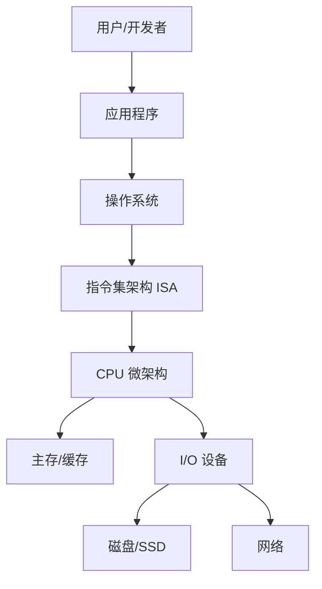
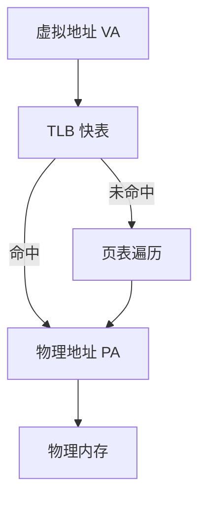

# 图解计算机原理：从开机到程序运行的全链路解析

> 面向读者：希望系统理解“程序为什么能跑起来”的工程师与学生。

虽然本仓库目前只有极简结构（`README.md`），但这恰好适合作为“从 0 到 1”讲解计算机原理的切入点：
- 输入：一段文本（代码或数据）
- 处理：CPU + 内存 + 总线 + 操作系统
- 输出：文件、网络响应、图形界面

---

## 1. 计算机系统的分层地图

先看整体：



### 分层含义
1. **应用层**：你写的程序（例如读取 `README.md`）。
2. **操作系统层**：通过系统调用把“读文件”翻译成内核可执行动作。
3. **ISA 层**：定义机器指令语义（如 x86-64、ARMv8）。
4. **微架构层**：流水线、乱序执行、分支预测等具体实现。
5. **硬件资源层**：缓存、内存、磁盘、网卡。

---

## 2. 冯·诺依曼模型：程序存储在内存里

核心思想：**程序和数据都在同一存储体系中，用地址区分**。

```text
+-------------------------------+
|           主存（RAM）          |
+-------------------------------+
| 代码段(text)  | 指令           |
| 数据段(data)  | 全局变量       |
| 堆(heap)      | 动态分配对象   |
| 栈(stack)     | 函数调用帧     |
+-------------------------------+
```

### 为什么重要？
- CPU 的工作本质是“**取指-译码-执行**”循环。
- 代码本质也是数据，支持加载器动态装载与链接。
- 缺点是“冯诺依曼瓶颈”：CPU 算得快，访存常常跟不上。

---

## 3. CPU 如何执行一条指令（微观视角）

### 3.1 指令周期


### 3.2 五级流水线（经典教学模型）
- IF: Instruction Fetch
- ID: Instruction Decode
- EX: Execute
- MEM: Memory Access
- WB: Write Back

**流水线收益**：提升吞吐量（单位时间完成更多指令），而非单条指令时延。

**三类冒险（Hazard）**：
1. 结构冒险：硬件资源冲突。
2. 数据冒险：前后指令存在读写依赖。
3. 控制冒险：分支跳转导致取指路径不确定。

工程上通过旁路转发、乱序执行、分支预测、投机执行来缓解。

---

## 4. 存储层次：为什么有缓存

CPU 与内存速度差异巨大，因此采用分层：

```text
寄存器  >  L1 Cache  >  L2 Cache  >  L3 Cache  >  DRAM  >  SSD
（快小贵）                                      （慢大便宜）
```

### 两条局部性原理
- **时间局部性**：刚访问的数据未来可能再次访问。
- **空间局部性**：相邻地址数据常被连续访问。

这也是为什么顺序遍历数组通常快于链表随机跳转。

---

## 5. 操作系统：硬件资源的“总调度员”

### 5.1 进程与线程
- **进程**：资源分配单位（独立地址空间）。
- **线程**：CPU 调度单位（共享进程内存）。

### 5.2 虚拟内存
每个进程看到“连续、私有”的虚拟地址空间，内核通过页表映射到物理内存：



收益：隔离、安全、按需分页；代价：地址翻译开销与缺页中断开销。

---

## 6. 一个真实动作的端到端路径：读取仓库 README

以“读取当前仓库里的 `README.md`”为例：

1. 应用发起 `read` 系统调用。
2. 内核检查文件描述符与权限。
3. 文件系统定位 inode 与数据块。
4. 若数据不在页缓存，触发磁盘 I/O。
5. 数据进入内核页缓存，再拷贝到用户缓冲区。
6. CPU 执行用户态代码处理文本。

这个过程同时涉及：
- CPU 指令执行
- 虚拟内存映射
- 中断与上下文切换
- 文件系统元数据管理

---

## 7. 并发与一致性：多核时代的难点

### 7.1 为什么会有竞态条件
多个线程并发读写共享变量，若无同步，结果取决于执行时序。

### 7.2 常见同步原语
- 互斥锁（mutex）
- 读写锁（rwlock）
- 原子操作（CAS）
- 屏障（barrier）

### 7.3 内存模型
即使源代码顺序写，CPU/编译器也可能重排。并发正确性依赖：
- 原子性
- 可见性
- 有序性（happens-before）

---

## 8. 工程实践：如何把原理转化为性能收益

1. **数据结构贴近缓存**：优先连续内存布局。
2. **减少系统调用**：批量 I/O、缓冲写。
3. **控制锁粒度**：降低竞争与上下文切换。
4. **面向热点优化**：先 profile，再优化。
5. **理解成本模型**：CPU 周期、cache miss、I/O 延迟。

---

## 9. 总结

计算机原理可以概括为一句话：

> **程序 = 状态 + 指令；计算机 = 在时间上推进状态机的系统。**

从应用代码到硬件执行，中间每一层都在做“抽象 + 映射 + 优化”。当你理解了这条链路，调试、优化、架构设计都会更有把握。

---

## 附：建议的进阶学习路径

1. 计算机组成原理（数字逻辑、CPU、存储层次）
2. 操作系统（进程、内存、文件系统、调度）
3. 计算机网络（分层协议、拥塞控制）
4. 编译原理（前端、优化、代码生成）
5. 性能工程（profiling、benchmark、火焰图）

如果你愿意，我可以下一篇直接结合你常用语言（C++/Go/Rust/Python）写“同一段代码在 CPU 与 OS 上到底发生了什么”的逐层剖析版。
